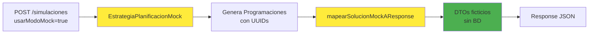

# 🎭 Guía Rápida: Modo Mock Sin Persistencia

## 🎯 Propósito

El modo mock **NO persiste nada en la base de datos**. Solo genera DTOs ficticios para testear el flujo de simulación sin efectos secundarios.

---

## 🚀 Uso

### JSON para Simulación Mock:

```json
{
  "tipoSimulacion": "SEMANAL",
  "usarModoMock": true,
  "seed": 42
}
```

### Resultado Esperado:

```json
{
  "idPlanificacion": null,
  "fechaHoraFinPlanif": null,
  "colapsado": false,
  "fitnessConseguido": 0.0,
  "tiempoEjecucionMs": 5,
  "rutas": [
    {
      "pedido": {
        "idPedido": 123,
        "cantidadTotal": 1,
        "producto": {
          "uuid": "f47ac10b-58cc-4372-a567-0e02b2c3d479",
          "idAlmacenInfinitoOrigen": -1,
          "existe": false
        },
        "almacenDestino": {
          "id": -1,
          "codigoAeropuerto": "MOCK",
          "codigoCiudad": "TEST"
        }
      },
      "vuelosDeRutaParaAtenderPedido": [
        {
          "idVuelo": 456,
          "idAlmacenOrigen": -1,
          "idAlmacenDestino": -1,
          "codigoAeropuertoOrigenEn4Siglas": "MOCK",
          "codigoAeropuertoDestinoEn4Siglas": "MOCK",
          "ciudadOrigenEn4Siglas": "TEST",
          "ciudadDestinoEn4Siglas": "TEST",
          "orden": 1
        }
      ]
    }
  ],
  "huboErrorEjecucion": false,
  "razonErrorEjecucion": null
}
```

---

## 🔍 Identificar Datos Mock

### Indicadores de que es mock:

- ✅ `idAlmacenInfinitoOrigen: -1`
- ✅ `codigoAeropuerto: "MOCK"`
- ✅ `codigoCiudad: "TEST"`
- ✅ `tiempoEjecucionMs: < 100` (milisegundos)

### Datos Reales (solo IDs):

- ✅ `idPedido`: ID real del pedido del EstadoGlobal
- ✅ `idVuelo`: ID real del vuelo seleccionado
- ✅ `uuid`: UUID único generado para el producto

---

## 🎬 Flujo Interno



---

## ⚠️ Diferencias vs Modo Normal

| Aspecto | Modo Normal | Modo Mock |
|---------|-------------|-----------|
| **Persistencia** | ✅ Guarda en BD | ❌ No guarda nada |
| **Consultas BD** | ✅ Lee entidades | ❌ No consulta |
| **Hibernate** | ✅ Sesión activa | ❌ Sin sesión |
| **Validaciones** | ✅ Completas | ⚠️ Mínimas |
| **Tiempo** | 🐢 30-300 seg | ⚡ < 1 seg |
| **Fitness** | ✅ Calculado | ⚠️ Ficticio (0.0) |
| **Productos** | ✅ Existen | ❌ Ficticios |

---

## 🧪 Testing

### Verificar que NO se persiste:

```sql
-- Antes de ejecutar mock
SELECT COUNT(*) FROM producto;  -- Ej: 100

-- Ejecutar simulación mock

-- Después de ejecutar mock
SELECT COUNT(*) FROM producto;  -- Debe seguir siendo 100
```

### Verificar que la simulación funciona:

```bash
# 1. Iniciar simulación mock
POST http://localhost:8080/api/simulaciones
{
  "tipoSimulacion": "SEMANAL",
  "usarModoMock": true
}

# 2. Verificar que retorna 200 OK con rutas

# 3. Verificar que BD no cambió
```

---

## 🎯 Casos de Uso

### ✅ Usar Mock cuando:

- 🧪 Estás testeando WebSockets
- 🐛 Estás debugeando eventos de simulación
- 🚀 Necesitas respuesta rápida
- 🧹 No quieres ensuciar la BD
- 🔧 El algoritmo GRASP tiene bugs

### ❌ NO usar Mock cuando:

- 📊 Necesitas datos reales para análisis
- ✅ Validar algoritmo de planificación
- 💾 Quieres persistir resultados
- 🎯 Probar optimización de fitness
- 🔍 Verificar integridad de datos

---

## 🐛 Troubleshooting

### Error: LazyInitializationException en obtenerDatosParaAlgoritmo()

**Stack trace:**
```
LazyInitializationException: failed to lazily initialize a collection of role: 
pe.edu.pucp.inf.pddsbackend.modelos.entidades.AlmacenEntidad.productosActuales
at Almacen.desdeEntidad(Almacen.java:74)
at PlanificacionServiceImpl.obtenerAlmacenesParaAlgoritmo(PlanificacionServiceImpl.java:173)
```

**Causa**: El método `obtenerDatosParaAlgoritmo()` carga entidades de Hibernate (almacenes, vuelos, pedidos) que tienen relaciones lazy. Cuando se accede a estas relaciones fuera de una transacción, Hibernate falla.

**Solución aplicada**: Se agregó `@Transactional(readOnly = true)` al método `obtenerDatosParaAlgoritmo()` para mantener la sesión de Hibernate activa durante la carga de datos.

```java
@Transactional(readOnly = true)
@Override
public EstadoGlobal obtenerDatosParaAlgoritmo(RealizarPlanificacionDTO params) {
    // Ahora puede acceder a relaciones lazy sin problemas
    HashMap<Long, Almacen> almacenes = obtenerAlmacenesParaAlgoritmo();
    // ...
}
```

### Error: LazyInitializationException en mapeo de solución

**Causa**: El código está intentando acceder a relaciones Hibernate fuera de sesión al mapear la solución.

**Solución**: Asegúrate de que `usarModoMock=true` esté en el JSON. El mock usa `mapearSolucionMockAResponse()` que NO accede a entidades.

### Error: NullPointerException en mapeo

**Causa**: El mock no genera todos los datos que espera el frontend.

**Solución**: Actualizar frontend para manejar valores `-1` y `"MOCK"` como ficticios.

### Warning: Productos con idAlmacen=-1

**Eso es normal en mock**. No es un error, es intencional para indicar datos ficticios.

---

## 📚 Archivos Relacionados

- `EstrategiaPlanificacionMock.java`: Genera programaciones mock
- `PlanificacionServiceImpl.java`: 
  - `mapearSolucionMockAResponse()`: Mapeo sin BD
  - `realizarPlanificacionDePedidosActualesConPersistencia()`: Decide qué mapeo usar
- `SimulacionRequestDTO.java`: Campo `usarModoMock`
- `RealizarPlanificacionDTO.java`: Campo `usarModoMock`

---

## 🎓 Resumen

**Mock = Testing sin persistencia**

- 🎭 Genera DTOs ficticios válidos
- ⚡ Ejecución instantánea
- 🧹 No toca la base de datos
- ✅ Perfecto para WebSockets y debugging
- ⚠️ NO usar en producción

**Uso básico:**
```json
{"tipoSimulacion": "SEMANAL", "usarModoMock": true}
```

**Identificar mock:**
```
idAlmacen = -1
codigoAeropuerto = "MOCK"
codigoCiudad = "TEST"
```
